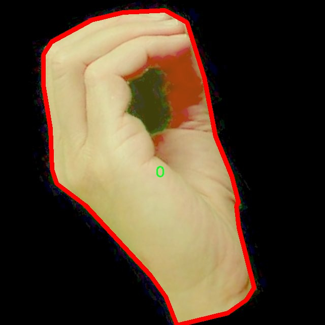

# 手势分割系统源码＆数据集分享
 [yolov8-seg＆yolov8-seg-dyhead等50+全套改进创新点发刊_一键训练教程_Web前端展示]

### 1.研究背景与意义

项目参考[ILSVRC ImageNet Large Scale Visual Recognition Challenge](https://gitee.com/YOLOv8_YOLOv11_Segmentation_Studio/projects)

项目来源[AAAI Global Al lnnovation Contest](https://kdocs.cn/l/cszuIiCKVNis)

研究背景与意义

随着人工智能技术的迅猛发展，计算机视觉领域在手势识别和分割方面取得了显著进展。手势作为人类沟通的重要方式，能够有效传达情感和意图，因此，手势识别技术在智能人机交互、虚拟现实、增强现实等应用场景中愈发重要。近年来，深度学习特别是卷积神经网络（CNN）的发展为手势识别提供了强大的技术支持。YOLO（You Only Look Once）系列模型以其快速和高效的目标检测能力，成为了手势识别领域的重要工具。然而，传统的YOLO模型在复杂环境下的手势分割精度仍然存在提升空间。因此，基于改进YOLOv8的手势分割系统的研究显得尤为必要。

本研究所采用的数据集包含1100幅图像，涵盖36个类别的手势，包括数字0-9和字母A-Z。这一丰富的类别设置不仅能够满足基本的手势识别需求，还能够为更复杂的手势组合提供基础。数据集的多样性和丰富性为模型的训练提供了良好的基础，使得手势识别系统能够在多种场景下进行有效的学习和适应。手势的多样性使得系统能够更好地理解和识别不同的手势，进而提升识别的准确性和鲁棒性。

改进YOLOv8模型的研究具有重要的理论和实践意义。首先，从理论层面来看，改进YOLOv8模型可以在保持高效性的同时，进一步提升手势分割的精度。这将为计算机视觉领域的手势识别研究提供新的思路和方法，推动相关技术的发展。其次，从实践层面来看，基于改进YOLOv8的手势分割系统能够广泛应用于智能家居、智能医疗、游戏娱乐等多个领域。例如，在智能家居中，用户可以通过手势控制家电设备，实现更加便捷的操作；在医疗领域，手势识别技术可以辅助医生进行远程手术或实时监测患者状态；在游戏娱乐中，手势识别能够提升用户的沉浸感和互动体验。

此外，手势识别技术的进步也将促进无障碍技术的发展，为听障人士提供更好的沟通工具，增强他们的社会参与感和生活质量。因此，基于改进YOLOv8的手势分割系统不仅具有学术研究的价值，更具备广泛的社会应用前景。

综上所述，基于改进YOLOv8的手势分割系统的研究不仅能够提升手势识别的准确性和效率，还能够推动相关技术的进步，具有重要的理论价值和实际应用意义。通过对数据集的深入分析和模型的优化，本研究将为手势识别领域的未来发展奠定坚实的基础。

### 2.图片演示


##### 注意：由于此博客编辑较早，上面“2.图片演示”和“3.视频演示”展示的系统图片或者视频可能为老版本，新版本在老版本的基础上升级如下：（实际效果以升级的新版本为准）

  （1）适配了YOLOV8的“目标检测”模型和“实例分割”模型，通过加载相应的权重（.pt）文件即可自适应加载模型。

  （2）支持“图片识别”、“视频识别”、“摄像头实时识别”三种识别模式。

  （3）支持“图片识别”、“视频识别”、“摄像头实时识别”三种识别结果保存导出，解决手动导出（容易卡顿出现爆内存）存在的问题，识别完自动保存结果并导出到tempDir中。

  （4）支持Web前端系统中的标题、背景图等自定义修改，后面提供修改教程。

  另外本项目提供训练的数据集和训练教程,暂不提供权重文件（best.pt）,需要您按照教程进行训练后实现图片演示和Web前端界面演示的效果。

### 3.视频演示

[3.1 视频演示](https://www.bilibili.com/video/BV1n21kYrEqM/)

### 4.数据集信息展示

##### 4.1 本项目数据集详细数据（类别数＆类别名）

nc: 36
names: ['0', '1', '2', '3', '4', '5', '6', '7', '8', '9', 'A', 'B', 'C', 'D', 'E', 'F', 'G', 'H', 'I', 'J', 'K', 'L', 'M', 'N', 'O', 'P', 'Q', 'R', 'S', 'T', 'U', 'V', 'W', 'X', 'Y', 'Z']


##### 4.2 本项目数据集信息介绍

数据集信息展示

在手势识别领域，数据集的构建与选择至关重要，尤其是在训练深度学习模型时。为此，我们采用了名为“sign_recognition”的数据集，该数据集专门设计用于改进YOLOv8-seg的手势分割系统。该数据集包含36个类别，涵盖了数字和字母的手势表达，具体类别包括从0到9的数字以及从A到Z的字母。这种丰富的类别设置不仅为模型提供了多样化的训练样本，也使得其在实际应用中能够更好地识别和分类不同的手势。

“sign_recognition”数据集的构建过程注重多样性和代表性，确保每个类别都有足够的样本量，以便模型能够学习到每个手势的特征。在手势识别的实际应用中，手势的表现形式可能因个体差异而有所不同，因此数据集中包含了来自不同背景、不同手型和不同手势表现的样本。这种多样性使得模型在面对真实世界中的复杂情况时，能够更具鲁棒性和适应性。

数据集中的每个类别均经过精心标注，确保每个手势的边界和特征能够被准确识别。为了提高模型的分割精度，数据集还包括了不同光照条件、背景环境和手势速度下的样本。这种丰富的环境设置使得模型在训练过程中能够学习到更全面的特征，从而在推理阶段表现出更高的准确率。

在使用“sign_recognition”数据集进行YOLOv8-seg模型的训练时，采用了数据增强技术，以进一步提升模型的泛化能力。通过对原始图像进行旋转、缩放、翻转和颜色调整等操作，生成了大量变体样本。这些增强样本不仅增加了数据集的多样性，还帮助模型更好地适应不同的手势表现形式和环境变化。

此外，为了确保数据集的高质量和有效性，所有样本均经过严格的审核和筛选，剔除了模糊、重叠或标注不准确的图像。这一过程不仅提高了数据集的整体质量，也为后续的模型训练提供了可靠的基础。

在训练过程中，模型通过不断迭代学习，逐步优化其参数，以实现对手势的精确分割。通过“sign_recognition”数据集的支持，YOLOv8-seg能够有效地识别和分割出手势图像中的目标区域，为手势识别技术的发展提供了强有力的支撑。

综上所述，“sign_recognition”数据集不仅在类别数量和样本多样性上具有显著优势，而且在数据质量和标注准确性方面也经过严格把关。它为改进YOLOv8-seg的手势分割系统提供了坚实的基础，推动了手势识别技术的进一步发展与应用。





### 5.全套项目环境部署视频教程（零基础手把手教学）

[5.1 环境部署教程链接（零基础手把手教学）](https://www.bilibili.com/video/BV1jG4Ve4E9t/?vd_source=bc9aec86d164b67a7004b996143742dc)


[5.2 安装Python虚拟环境创建和依赖库安装视频教程链接（零基础手把手教学）](https://www.bilibili.com/video/BV1nA4VeYEze/?vd_source=bc9aec86d164b67a7004b996143742dc)

### 6.手把手YOLOV8-seg训练视频教程（零基础小白有手就能学会）

[6.1 手把手YOLOV8-seg训练视频教程（零基础小白有手就能学会）](https://www.bilibili.com/video/BV1cA4VeYETe/?vd_source=bc9aec86d164b67a7004b996143742dc)


按照上面的训练视频教程链接加载项目提供的数据集，运行train.py即可开始训练



     Epoch   gpu_mem       box       obj       cls    labels  img_size
     1/200     0G   0.01576   0.01955  0.007536        22      1280: 100%|██████████| 849/849 [14:42<00:00,  1.04s/it]
               Class     Images     Labels          P          R     mAP@.5 mAP@.5:.95: 100%|██████████| 213/213 [01:14<00:00,  2.87it/s]
                 all       3395      17314      0.994      0.957      0.0957      0.0843

     Epoch   gpu_mem       box       obj       cls    labels  img_size
     2/200     0G   0.01578   0.01923  0.007006        22      1280: 100%|██████████| 849/849 [14:44<00:00,  1.04s/it]
               Class     Images     Labels          P          R     mAP@.5 mAP@.5:.95: 100%|██████████| 213/213 [01:12<00:00,  2.95it/s]
                 all       3395      17314      0.996      0.956      0.0957      0.0845

     Epoch   gpu_mem       box       obj       cls    labels  img_size
     3/200     0G   0.01561    0.0191  0.006895        27      1280: 100%|██████████| 849/849 [10:56<00:00,  1.29it/s]
               Class     Images     Labels          P          R     mAP@.5 mAP@.5:.95: 100%|███████   | 187/213 [00:52<00:00,  4.04it/s]
                 all       3395      17314      0.996      0.957      0.0957      0.0845


### 7.50+种全套YOLOV8-seg创新点代码加载调参视频教程（一键加载写好的改进模型的配置文件）

[7.1 50+种全套YOLOV8-seg创新点代码加载调参视频教程（一键加载写好的改进模型的配置文件）](https://www.bilibili.com/video/BV1Hw4VePEXv/?vd_source=bc9aec86d164b67a7004b996143742dc)

### 8.YOLOV8-seg图像分割算法原理

原始YOLOv8-seg算法原理

YOLOv8-seg算法作为YOLO系列的最新版本，结合了目标检测与语义分割的优势，展现出卓越的性能与灵活性。其核心思想在于通过优化网络结构与引入先进的损失函数，提升目标检测的精度与效率。YOLOv8-seg的设计理念源于对YOLOv5及其后续版本的深入研究，旨在解决传统目标检测算法在复杂场景下的局限性，尤其是在处理细粒度分割任务时的不足。

首先，YOLOv8-seg在骨干网络中采用了跨级结构（Cross Stage Partial, CSP）的设计理念。这一结构通过将特征流分为多个分支，使得网络在保持高效性的同时，能够更好地捕捉多层次的特征信息。与YOLOv5中的C3模块相比，YOLOv8-seg对其进行了优化，替换为更轻量化的C2F模块。这一变化不仅减少了计算复杂度，还增强了特征提取的能力，使得网络在处理不同尺度的目标时更加灵活。

在特征融合方面，YOLOv8-seg继续采用特征金字塔网络（FPN）与路径聚合网络（PAN）的结合，形成了一个强大的特征融合层。通过这种双塔结构，网络能够有效地整合来自不同层次的特征信息，提升对小目标的检测能力。值得注意的是，YOLOv8-seg在特征融合过程中引入了BiFPN（Bidirectional Feature Pyramid Network），这种高效的双向跨尺度连接机制使得特征信息的提取与融合更加迅速，进一步提高了模型的整体性能。

YOLOv8-seg在检测模块的设计上也进行了创新，采用了解耦头结构。这一结构将回归分支与分类分支分离，使得模型在进行目标检测时能够更快地收敛，同时提高了对复杂场景的适应能力。解耦头的引入使得YOLOv8-seg在进行目标定位与分类时，能够独立优化各自的损失函数，从而实现更高的精度。

为了进一步提升检测精度，YOLOv8-seg采用了新的损失策略。通过变焦损失（Focal Loss）计算分类损失，结合数据平均保真度损失与完美交并比损失（IoU Loss）对边界框损失进行优化，这一策略使得模型在面对样本不均衡时，能够更好地关注难以检测的目标，减少漏检现象的发生。特别是在复杂背景下，YOLOv8-seg能够通过精确的损失计算，有效地提升模型的鲁棒性。

此外，YOLOv8-seg还在数据处理阶段引入了Mosaic增强技术。这一技术通过将多张图像拼接在一起，生成新的训练样本，极大地丰富了数据集的多样性。结合目标检测与分割任务的特点，YOLOv8-seg能够在训练过程中有效地提高模型的泛化能力，使其在实际应用中表现出色。

在具体应用中，YOLOv8-seg的轻量化特性使其能够在资源受限的环境中运行，如移动设备或边缘计算平台。这一优势使得YOLOv8-seg不仅适用于传统的目标检测任务，还能够广泛应用于实时视频监控、自动驾驶、医疗影像分析等多个领域。通过对特征提取网络的进一步轻量化设计，YOLOv8-seg在保证检测精度的同时，显著降低了计算成本，提升了处理速度。

综上所述，YOLOv8-seg算法通过一系列创新的设计与优化，成功地将目标检测与语义分割相结合，形成了一种高效、准确且轻量化的检测框架。其在网络结构、特征融合、损失计算等方面的改进，使得YOLOv8-seg在复杂场景下依然能够保持卓越的性能。随着深度学习技术的不断发展，YOLOv8-seg无疑将在未来的计算机视觉任务中发挥越来越重要的作用。


### 9.系统功能展示（检测对象为举例，实际内容以本项目数据集为准）

图9.1.系统支持检测结果表格显示

  图9.2.系统支持置信度和IOU阈值手动调节

  图9.3.系统支持自定义加载权重文件best.pt(需要你通过步骤5中训练获得)

  图9.4.系统支持摄像头实时识别

  图9.5.系统支持图片识别

  图9.6.系统支持视频识别

  图9.7.系统支持识别结果文件自动保存

  图9.8.系统支持Excel导出检测结果数据


### 10.50+种全套YOLOV8-seg创新点原理讲解（非科班也可以轻松写刊发刊，V11版本正在科研待更新）

#### 10.1 由于篇幅限制，每个创新点的具体原理讲解就不一一展开，具体见下列网址中的创新点对应子项目的技术原理博客网址【Blog】：


[10.1 50+种全套YOLOV8-seg创新点原理讲解链接](https://gitee.com/qunmasj/good)

#### 10.2 部分改进模块原理讲解(完整的改进原理见上图和技术博客链接)
### YOLOv8简介
YOLOv8目标检测算法继承了YOLOv1系列的思考,是一种新型端到端的目标检测算法,尽管现在原始检测算法已经开源,但是鲜有发表的相关论文.YOLOv8的网络结构如图所示,主要可分为Input输入端、Backbone骨干神经网络、Neck 混合特征网络层和Head预测层网络共4个部分.

YOLO目标检测算法是一种端到端的One-Slage 目标检测算法，其核心思想是将图像按区域分块进行预测。YOLO将输入图像按照32x32的大小划分成若干个网格，例如416x416的图像将被划分为13x13个网格。当目标物体的中心位于某个网格内时,该网格就会负责输出该物体的边界框和类别置信度。每个网格可以预测多个边界框和多个目标类别,这些边界框和类别的数量可以根据需要进行设置。YOLO算法的输出是一个特征图,包含了每个网格对应的边界框和类别置信度的信息呵。本文采用YOLO最新的YOLOv8模型，其是2022年底发布的最新YOLO系列模型，采用全新的SOTA模型，全新的网络主干结构,如图1所示。
整个网络分为Backbone 骨干网络部分和Head头部网络部分。YOLOv8汲取了前几代网络的优秀特性，骨干网络和 Neck部分遵循CSP的思想，将YOLOv5中的C3模块被替换成了梯度流更丰富C2模块,去掉YOLOv5中 PAN-FPN上采样阶段中的卷积结构,将Backbone不同阶段输出的特征直接送入了上采样操作,模型提供了N/S/M/L/X尺度的不同大小模型,能够满足不同领域业界的需求。本文基于YOLOv8模型设计番茄病虫害检测系统，通过配置模型参数训练番茄图像,得到能够用于部署应用的最优模型。


### 感受野注意力卷积（RFAConv)
#### 标准卷积操作回顾
标准的卷积操作是构造卷积神经网络的基本构件。它利用具有共享参数的滑动窗口提取特征信息，克服了全连通层构造神经网络固有的参数多、计算开销大的问题。设 X R∈C×H×W
表示输入特征图，其中C、H、W分别表示特征图的通道数、高度、宽度。为了清楚地演示卷积核的特征提取过程，我们使用 C = 1 的例子。从每个接受域滑块中提取特征信息的卷积运算可以表示为:


这里，Fi 表示计算后每个卷积滑块得到的值，Xi 表示每个滑块内对应位置的像素值，K表示卷积核，S表示卷积核中的参数个数，N表示接收域滑块的总数。可以看出，每个滑块内相同位置的 feature共享相同的参数Ki。因此，标准的卷积运算并不能捕捉到不同位置所带来的信息差异，这最终在一定程度上限制了卷积神经网络的性能。 

#### 空间注意力回顾
目前，空间注意机制是利用学习得到的注意图来突出每个特征的重要性。与前一节类似，这里以 C=1为例。突出关键特征的空间注意机制可以简单表述为:这里，Fi 表示加权运算后得到的值。xi 和Ai 表示输入特征图和学习到的注意图在不同位置的值，N为输入特征图的高和宽的乘积，表示像素值的总数。


#### 空间注意与标准卷积运算
将注意力机制整合到卷积神经网络中，可以提高卷积神经网络的性能。通过对标准卷积运算和现有空间注意机制的研究，我们认为空间注意机制有效地克服了卷积神经网络固有的参数共享的局限性。目前卷积神经网络中最常用的核大小是 1 × 1和3 × 3。在引入空间注意机制后，提取特征的卷积操作可以是 1 × 1或3 × 3卷积操作。为了直观地展示这个过程，在 1 × 1卷积运算的前面插入了空间注意机制。通过注意图对输入特征图(Re-weight“×”)进行加权运算，最后通过 1 × 1卷积运算提取接收域的滑块特征信息。整个过程可以简单地表示如下:


 这里卷积核K仅代表一个参数值。如果取A i× ki 的值作为一种新的卷积核参数，有趣的是它解决了 1×1卷积运算提取特征时的参数共享问题。然而，关于空间注意机制的传说到此结束。当空间注意机制被插入到3×3卷积运算前面时。具体情况如下:


如上所述，如果取A的值 i × ki (4)式作为一种新的卷积核参数，完全解决了大规模卷积核的参数共享问题。然而，最重要的一点是，卷积核在提取每个接受域滑块的特征时，会共享一些特征。换句话说，每个接收域滑块内都有一个重叠。仔细分析后会发现A12= a21， a13 = a22， a15 = a24……，在这种情况下，每个滑动窗口共享空间注意力地图的权重。因此，空间注意机制没有考虑整个接受域的空间特征，不能有效地解决大规模卷积核的参数共享问题。因此，空间注意机制的有效性受到限制。 

#### 创新空间注意力和标准卷积操作
该博客提出解决了现有空间注意机制的局限性，为空间处理提供了一种创新的解决方案。受RFA的启发，一系列空间注意机制被开发出来，可以进一步提高卷积神经网络的性能。RFA可以看作是一个轻量级即插即用模块，RFA设计的卷积运算(RFAConv)可以代替标准卷积来提高卷积神经网络的性能。因此，我们预测空间注意机制与标准卷积运算的结合将继续发展，并在未来带来新的突破。
接受域空间特征:为了更好地理解接受域空间特征的概念，我们将提供相关的定义。接收域空间特征是专门为卷积核设计的，并根据核大小动态生成。如图1所示，以3×3卷积核为例。在图1中，“Spatial Feature”指的是原始的Feature map。“接受域空间特征”是空间特征变换后的特征图。

 

由不重叠的滑动窗口组成。当使用 3×3卷积内核提取特征时，接收域空间特征中的每个 3×3大小窗口代表一个接收域滑块。接受域注意卷积(RFAConv):针对接受域的空间特征，我们提出了接受域注意卷积(RFA)。该方法不仅强调了接收域滑块内不同特征的重要性，而且对接收域空间特征进行了优先排序。通过该方法，完全解决了卷积核参数共享的问题。接受域空间特征是根据卷积核的大小动态生成的，因此，RFA是卷积的固定组合，不能与卷积操作的帮助分离，卷积操作同时依赖于RFA来提高性能，因此我们提出了接受场注意卷积(RFAConv)。具有3×3大小的卷积核的RFAConv整体结构如图所示。


目前，最广泛使用的接受域特征提取方法是缓慢的。经过大量的研究，我们开发了一种快速的方法，用分组卷积来代替原来的方法。具体来说，我们利用相应大小的分组卷积来动态生成基于接受域大小的展开特征。尽管与原始的无参数方法(如PyTorch提供的nn.())相比，该方法增加了一些参数，但它的速度要快得多。注意:如前一节所述，当使用 3×3卷积内核提取特征时，接收域空间特征中的每个 3×3大小窗口表示一个接收域滑块。而利用快速分组卷积提取感受野特征后，将原始特征映射为新的特征。最近的研究表明。交互信息可以提高网络性能，如[40,41,42]所示。同样，对于RFAConv来说，通过交互接受域特征信息来学习注意图可以提高网络性能。然而，与每个接收域特征交互会导致额外的计算开销，因此为了最小化计算开销和参数的数量，我们使用AvgPool来聚合每个接收域特征的全局信息。然后，使用 1×1 组卷积操作进行信息交互。最后，我们使用softmax来强调每个特征在接受域特征中的重要性。一般情况下，RFA的计算可以表示为:


这里gi×i 表示一个大小为 i×i的分组卷积，k表示卷积核的大小，Norm表示归一化，X表示输入的特征图，F由注意图 a相乘得到 rf 与转换后的接受域空间特征 Frf。与CBAM和CA不同，RFA能够为每个接受域特征生成注意图。卷积神经网络的性能受到标准卷积操作的限制，因为卷积操作依赖于共享参数，对位置变化带来的信息差异不敏感。然而，RFAConv通过强调接收域滑块中不同特征的重要性，并对接收域空间特征进行优先级排序，可以完全解决这个问题。通过RFA得到的feature map是接受域空间特征，在“Adjust Shape”后没有重叠。因此，学习到的注意图将每个接受域滑块的特征信息聚合起来。换句话说，注意力地图不再共享在每个接受域滑块。这完全弥补了现有 CA和CBAM注意机制的不足。RFA为标准卷积内核提供了显著的好处。而在调整形状后，特征的高度和宽度是 k倍，需要进行 stride = k的k × k卷积运算来提取特征信息。RFA设计的卷积运算RFAConv为卷积带来了良好的增益，对标准卷积进行了创新。
此外，我们认为现有的空间注意机制应该优先考虑接受域空间特征，以提高网络性能。众所周知，基于自注意机制的网络模型[43,44,45]取得了很大的成功，因为它解决了卷积参数共享的问题，并对远程信息进行建模。然而，自注意机制也为模型引入了显著的计算开销和复杂性。我们认为，将现有的空间注意机制的注意力引导到接受场空间特征上，可以以类似于自我注意的方式解决长期信息的参数共享和建模问题。与自我关注相比，这种方法需要的参数和计算资源少得多。答案如下:(1)将以接收场空间特征为中心的空间注意机制与卷积相结合，消除了卷积参数共享的问题。(2)现有的空间注意机制已经考虑了远程信息，可以通过全局平均池或全局最大池的方式获取全局信息，其中明确考虑了远程信息。因此，我们设计了新的 CBAM和CA模型，称为RFCBAM和RFCA，它们专注于接受域空间特征。与RFA类似，使用最终的k × k stride = k 的卷积运算来提取特征信息。这两种新的卷积方法的具体结构如图 3所示，我们称这两种新的卷积操作为 RFCBAMConv和RFCAConv。与原来的CBAM相比，我们在RFCBAM中使用SE attention来代替CAM。因为这样可以减少计算开销。此外，在RFCBAM中，通道注意和空间注意不是分开执行的。相反，它们是同时加权的，使得每个通道获得的注意力地图是不同的。


### 11.项目核心源码讲解（再也不用担心看不懂代码逻辑）

#### 11.1 ultralytics\utils\callbacks\mlflow.py

以下是经过简化和注释的核心代码部分，保留了最重要的功能，并对每个部分进行了详细的中文注释：

```python
# 导入必要的库
from ultralytics.utils import LOGGER, RUNS_DIR, SETTINGS, TESTS_RUNNING, colorstr

try:
    import os
    import mlflow  # 导入mlflow库用于日志记录
    from pathlib import Path

    # 确保在非测试环境下运行，并且mlflow集成已启用
    assert not TESTS_RUNNING or 'test_mlflow' in os.environ.get('PYTEST_CURRENT_TEST', '')
    assert SETTINGS['mlflow'] is True
    assert hasattr(mlflow, '__version__')  # 确保mlflow库正确导入

    PREFIX = colorstr('MLflow: ')  # 设置日志前缀

except (ImportError, AssertionError):
    mlflow = None  # 如果导入失败，mlflow设置为None


def on_pretrain_routine_end(trainer):
    """
    在预训练例程结束时记录训练参数到MLflow。

    Args:
        trainer (ultralytics.engine.trainer.BaseTrainer): 训练对象，包含要记录的参数。

    Global:
        mlflow: 导入的mlflow模块，用于记录日志。

    Environment Variables:
        MLFLOW_TRACKING_URI: MLflow跟踪的URI，默认为'runs/mlflow'。
        MLFLOW_EXPERIMENT_NAME: MLflow实验的名称，默认为trainer.args.project。
        MLFLOW_RUN: MLflow运行的名称，默认为trainer.args.name。
    """
    global mlflow

    # 获取跟踪URI，默认值为'runs/mlflow'
    uri = os.environ.get('MLFLOW_TRACKING_URI') or str(RUNS_DIR / 'mlflow')
    LOGGER.debug(f'{PREFIX} tracking uri: {uri}')
    mlflow.set_tracking_uri(uri)  # 设置跟踪URI

    # 设置实验和运行名称
    experiment_name = os.environ.get('MLFLOW_EXPERIMENT_NAME') or trainer.args.project or '/Shared/YOLOv8'
    run_name = os.environ.get('MLFLOW_RUN') or trainer.args.name
    mlflow.set_experiment(experiment_name)  # 设置实验

    mlflow.autolog()  # 自动记录参数和指标
    try:
        # 开始一个新的运行
        active_run = mlflow.active_run() or mlflow.start_run(run_name=run_name)
        LOGGER.info(f'{PREFIX}logging run_id({active_run.info.run_id}) to {uri}')
        if Path(uri).is_dir():
            LOGGER.info(f"{PREFIX}view at http://127.0.0.1:5000 with 'mlflow server --backend-store-uri {uri}'")
        LOGGER.info(f"{PREFIX}disable with 'yolo settings mlflow=False'")
        mlflow.log_params(dict(trainer.args))  # 记录训练参数
    except Exception as e:
        LOGGER.warning(f'{PREFIX}WARNING ⚠️ Failed to initialize: {e}\n'
                       f'{PREFIX}WARNING ⚠️ Not tracking this run')


def on_fit_epoch_end(trainer):
    """在每个训练周期结束时记录训练指标到MLflow。"""
    if mlflow:
        # 清理指标名称并记录到MLflow
        sanitized_metrics = {k.replace('(', '').replace(')', ''): float(v) for k, v in trainer.metrics.items()}
        mlflow.log_metrics(metrics=sanitized_metrics, step=trainer.epoch)


def on_train_end(trainer):
    """在训练结束时记录模型工件。"""
    if mlflow:
        # 记录最佳模型和其他文件
        mlflow.log_artifact(str(trainer.best.parent))  # 记录最佳模型文件夹
        for f in trainer.save_dir.glob('*'):  # 记录保存目录中的所有文件
            if f.suffix in {'.png', '.jpg', '.csv', '.pt', '.yaml'}:
                mlflow.log_artifact(str(f))

        mlflow.end_run()  # 结束当前运行
        LOGGER.info(f'{PREFIX}results logged to {mlflow.get_tracking_uri()}\n'
                    f"{PREFIX}disable with 'yolo settings mlflow=False'")


# 定义回调函数
callbacks = {
    'on_pretrain_routine_end': on_pretrain_routine_end,
    'on_fit_epoch_end': on_fit_epoch_end,
    'on_train_end': on_train_end} if mlflow else {}
```

### 代码分析：
1. **导入模块**：导入了必要的库，包括`mlflow`用于日志记录和`ultralytics`的工具函数。
2. **环境检查**：确保在非测试环境下运行，并且`mlflow`集成已启用。
3. **日志记录函数**：
   - `on_pretrain_routine_end`：在预训练结束时记录训练参数，包括设置跟踪URI、实验名称和运行名称。
   - `on_fit_epoch_end`：在每个训练周期结束时记录训练指标。
   - `on_train_end`：在训练结束时记录模型工件，包括最佳模型和其他相关文件。
4. **回调函数**：定义了一个回调字典，以便在训练过程中调用相应的日志记录函数。

这个文件是Ultralytics YOLO项目中的一个模块，主要用于集成MLflow，以便记录训练过程中的参数、指标和模型工件。MLflow是一个开源平台，旨在管理机器学习生命周期，包括实验跟踪、模型管理和部署等功能。

文件开头的文档字符串简要说明了该模块的功能和使用方法。用户可以通过设置环境变量来配置实验名称、运行名称以及启动本地MLflow服务器等。具体命令包括设置项目名称、运行名称和启动服务器的指令，此外还提供了如何终止正在运行的MLflow服务器的命令。

接下来的代码部分首先导入了一些必要的模块和库，包括Ultralytics的日志记录器、运行目录、设置和颜色字符串。然后尝试导入os模块，并进行了一些断言检查，以确保在特定条件下（如不在测试环境中）才进行MLflow的集成。若导入或断言失败，则将mlflow设置为None。

在`on_pretrain_routine_end`函数中，记录了训练参数的日志。该函数在预训练例程结束时被调用，首先获取MLflow的跟踪URI，如果未设置，则默认使用'runs/mlflow'。接着，它设置实验名称和运行名称，并启动MLflow运行。然后，它将训练器的参数记录到MLflow中。如果在初始化过程中出现异常，则会记录警告信息。

`on_fit_epoch_end`函数用于在每个训练周期结束时记录训练指标。它会将训练器的指标进行清理，去掉括号，并将其作为浮点数记录到MLflow中。

`on_train_end`函数在训练结束时被调用，用于记录模型工件。它会记录最佳模型的保存目录及其他文件（如图像、CSV、模型权重等），并结束当前的MLflow运行。最后，它会记录结果的URI，方便用户查看。

最后，代码定义了一个回调字典，包含了上述三个函数，只有在mlflow可用的情况下才会被填充。这使得在训练过程中可以根据不同的事件触发相应的日志记录操作。整体来看，这个模块通过MLflow实现了对Ultralytics YOLO训练过程的全面监控和记录。

#### 11.2 ui.py

以下是代码中最核心的部分，并附上详细的中文注释：

```python
import sys
import subprocess

def run_script(script_path):
    """
    使用当前 Python 环境运行指定的脚本。

    Args:
        script_path (str): 要运行的脚本路径

    Returns:
        None
    """
    # 获取当前 Python 解释器的路径
    python_path = sys.executable

    # 构建运行命令，使用 streamlit 运行指定的脚本
    command = f'"{python_path}" -m streamlit run "{script_path}"'

    # 执行命令，并等待其完成
    result = subprocess.run(command, shell=True)
    
    # 检查命令执行的返回码，如果不为0，表示出错
    if result.returncode != 0:
        print("脚本运行出错。")


# 实例化并运行应用
if __name__ == "__main__":
    # 指定要运行的脚本路径
    script_path = "web.py"  # 假设脚本在当前目录下

    # 调用函数运行脚本
    run_script(script_path)
```

### 代码说明：
1. **导入模块**：
   - `sys`：用于获取当前 Python 解释器的路径。
   - `subprocess`：用于执行外部命令。

2. **`run_script` 函数**：
   - 该函数接收一个脚本路径作为参数，并使用当前 Python 环境运行该脚本。
   - 使用 `sys.executable` 获取当前 Python 解释器的路径。
   - 构建一个命令字符串，使用 `streamlit` 模块运行指定的脚本。
   - 使用 `subprocess.run` 执行构建的命令，并等待其完成。
   - 检查命令的返回码，如果返回码不为0，表示脚本运行出错，并打印错误信息。

3. **主程序块**：
   - 在主程序块中，指定要运行的脚本路径（这里假设脚本名为 `web.py`）。
   - 调用 `run_script` 函数来执行该脚本。

这个程序文件名为 `ui.py`，其主要功能是通过当前的 Python 环境来运行一个指定的脚本，具体是一个名为 `web.py` 的文件。程序首先导入了必要的模块，包括 `sys`、`os` 和 `subprocess`，以及一个自定义的路径处理函数 `abs_path`。

在 `run_script` 函数中，首先获取当前 Python 解释器的路径，这通过 `sys.executable` 实现。接着，构建一个命令字符串，用于运行 `streamlit`，这是一个用于构建数据应用的库。命令的格式是将 Python 解释器与 `-m streamlit run` 结合起来，后面跟上要运行的脚本路径。

然后，使用 `subprocess.run` 方法执行这个命令。这个方法会在一个新的子进程中运行命令，并等待其完成。如果脚本运行返回的状态码不为零，表示出现了错误，程序会打印出“脚本运行出错”的提示。

在文件的最后部分，使用 `if __name__ == "__main__":` 语句来确保只有在直接运行这个文件时才会执行后面的代码。这里指定了要运行的脚本路径为 `web.py`，并调用 `run_script` 函数来执行这个脚本。

总的来说，这个程序的核心功能是封装了一个简单的接口，通过命令行来运行一个 Streamlit 应用脚本，便于用户在当前 Python 环境中启动和管理应用。

#### 11.3 ultralytics\trackers\basetrack.py

以下是代码中最核心的部分，并附上详细的中文注释：

```python
from collections import OrderedDict
import numpy as np

class TrackState:
    """跟踪状态的枚举类，表示可能的对象跟踪状态。"""
    New = 0      # 新建状态
    Tracked = 1  # 正在跟踪状态
    Lost = 2     # 丢失状态
    Removed = 3  # 已移除状态

class BaseTrack:
    """对象跟踪的基类，处理基本的跟踪属性和操作。"""

    _count = 0  # 全局跟踪ID计数器

    track_id = 0  # 当前跟踪的ID
    is_activated = False  # 跟踪是否被激活
    state = TrackState.New  # 当前跟踪状态，初始为新建状态

    history = OrderedDict()  # 存储跟踪历史的有序字典
    features = []  # 存储特征的列表
    curr_feature = None  # 当前特征
    score = 0  # 跟踪得分
    start_frame = 0  # 跟踪开始的帧数
    frame_id = 0  # 当前帧ID
    time_since_update = 0  # 自上次更新以来的时间

    # 多摄像头支持
    location = (np.inf, np.inf)  # 跟踪对象的位置，初始化为无穷大

    @property
    def end_frame(self):
        """返回跟踪的最后帧ID。"""
        return self.frame_id

    @staticmethod
    def next_id():
        """递增并返回全局跟踪ID计数器。"""
        BaseTrack._count += 1
        return BaseTrack._count

    def activate(self, *args):
        """激活跟踪，使用提供的参数。"""
        raise NotImplementedError  # 抛出未实现异常，需在子类中实现

    def predict(self):
        """预测跟踪的下一个状态。"""
        raise NotImplementedError  # 抛出未实现异常，需在子类中实现

    def update(self, *args, **kwargs):
        """使用新的观测值更新跟踪。"""
        raise NotImplementedError  # 抛出未实现异常，需在子类中实现

    def mark_lost(self):
        """将跟踪标记为丢失。"""
        self.state = TrackState.Lost  # 更新状态为丢失

    def mark_removed(self):
        """将跟踪标记为已移除。"""
        self.state = TrackState.Removed  # 更新状态为已移除

    @staticmethod
    def reset_id():
        """重置全局跟踪ID计数器。"""
        BaseTrack._count = 0  # 将计数器重置为0
```

### 代码核心部分说明：
1. **TrackState 类**：定义了跟踪对象的不同状态，便于管理和更新跟踪状态。
2. **BaseTrack 类**：作为所有跟踪对象的基类，包含了跟踪所需的基本属性和方法。
   - `track_id`：唯一标识每个跟踪对象。
   - `is_activated`：指示跟踪对象是否已激活。
   - `state`：当前跟踪状态，初始为新建状态。
   - `history` 和 `features`：用于存储跟踪历史和特征信息。
   - `next_id` 方法：生成新的跟踪ID。
   - `activate`、`predict` 和 `update` 方法：这些方法需要在子类中实现，定义了跟踪对象的激活、预测和更新行为。
   - `mark_lost` 和 `mark_removed` 方法：用于更新跟踪状态为丢失或已移除。
   - `reset_id` 方法：用于重置全局跟踪ID计数器。

这个程序文件定义了一个用于对象跟踪的基础类`BaseTrack`，以及一个用于表示跟踪状态的枚举类`TrackState`。在对象跟踪的应用中，跟踪对象的状态和属性管理是非常重要的，因此这个文件提供了一些基本的功能和结构。

首先，`TrackState`类定义了四种可能的跟踪状态：`New`（新建）、`Tracked`（跟踪中）、`Lost`（丢失）和`Removed`（已移除）。这些状态可以帮助我们管理跟踪对象在不同时间点的状态变化。

接下来是`BaseTrack`类，它是所有跟踪对象的基类。这个类包含了一些基本的属性和方法，用于处理跟踪对象的生命周期和状态。`BaseTrack`类的属性包括：

- `track_id`：跟踪对象的唯一标识符。
- `is_activated`：一个布尔值，指示跟踪对象是否已激活。
- `state`：当前跟踪对象的状态，初始为`New`。
- `history`：一个有序字典，用于存储跟踪对象的历史记录。
- `features`：一个列表，用于存储跟踪对象的特征。
- `curr_feature`：当前特征，初始为`None`。
- `score`：跟踪对象的得分，初始为0。
- `start_frame`和`frame_id`：分别表示跟踪开始的帧和当前帧的ID。
- `time_since_update`：自上次更新以来的时间。
- `location`：一个元组，表示在多摄像头环境下的位置信息，初始为无穷大。

类中还定义了一些方法：

- `end_frame`属性：返回跟踪的最后一帧ID。
- `next_id`静态方法：用于生成下一个全局跟踪ID，并将计数器加一。
- `activate`、`predict`和`update`方法：这些方法是抽象的，具体实现需要在子类中定义，分别用于激活跟踪、预测下一个状态和更新跟踪信息。
- `mark_lost`和`mark_removed`方法：用于将跟踪对象标记为丢失或已移除。
- `reset_id`静态方法：重置全局跟踪ID计数器。

总的来说，这个文件为对象跟踪提供了一个基础框架，定义了跟踪对象的基本属性和操作方法，便于在后续的实现中扩展和使用。

#### 11.4 ultralytics\trackers\utils\kalman_filter.py

以下是经过简化和注释的核心代码部分，主要包含了 `KalmanFilterXYAH` 类的实现，适用于在图像空间中跟踪边界框的简单卡尔曼滤波器。

```python
import numpy as np
import scipy.linalg

class KalmanFilterXYAH:
    """
    用于边界框跟踪的简单卡尔曼滤波器。

    状态空间为8维（x, y, a, h, vx, vy, va, vh），包含边界框中心位置（x, y），
    纵横比a，高度h及其各自的速度。
    """

    def __init__(self):
        """初始化卡尔曼滤波器模型矩阵，设置运动和观测的不确定性权重。"""
        ndim, dt = 4, 1.  # 状态维度和时间步长

        # 创建卡尔曼滤波器模型矩阵
        self._motion_mat = np.eye(2 * ndim, 2 * ndim)  # 运动矩阵
        for i in range(ndim):
            self._motion_mat[i, ndim + i] = dt  # 设置速度部分
        self._update_mat = np.eye(ndim, 2 * ndim)  # 更新矩阵

        # 运动和观测的不确定性权重
        self._std_weight_position = 1. / 20
        self._std_weight_velocity = 1. / 160

    def initiate(self, measurement):
        """
        从未关联的测量值创建跟踪。

        参数
        ----------
        measurement : ndarray
            边界框坐标（x, y, a, h）。

        返回
        -------
        (ndarray, ndarray)
            返回新跟踪的均值向量和协方差矩阵。
        """
        mean_pos = measurement  # 位置均值
        mean_vel = np.zeros_like(mean_pos)  # 速度均值初始化为0
        mean = np.r_[mean_pos, mean_vel]  # 合并位置和速度均值

        # 计算协方差矩阵的标准差
        std = [
            2 * self._std_weight_position * measurement[3],  # 高度的标准差
            2 * self._std_weight_position * measurement[3],  # 高度的标准差
            1e-2,  # 纵横比的标准差
            2 * self._std_weight_position * measurement[3],  # 高度的标准差
            10 * self._std_weight_velocity * measurement[3],  # 速度的标准差
            10 * self._std_weight_velocity * measurement[3],  # 速度的标准差
            1e-5,  # 纵横比速度的标准差
            10 * self._std_weight_velocity * measurement[3]   # 速度的标准差
        ]
        covariance = np.diag(np.square(std))  # 协方差矩阵
        return mean, covariance

    def predict(self, mean, covariance):
        """
        执行卡尔曼滤波器预测步骤。

        参数
        ----------
        mean : ndarray
            先前时间步的状态均值向量。
        covariance : ndarray
            先前时间步的状态协方差矩阵。

        返回
        -------
        (ndarray, ndarray)
            返回预测状态的均值向量和协方差矩阵。
        """
        # 计算运动协方差
        std_pos = [
            self._std_weight_position * mean[3],  # 高度的标准差
            self._std_weight_position * mean[3],  # 高度的标准差
            1e-2,  # 纵横比的标准差
            self._std_weight_position * mean[3]   # 高度的标准差
        ]
        std_vel = [
            self._std_weight_velocity * mean[3],  # 速度的标准差
            self._std_weight_velocity * mean[3],  # 速度的标准差
            1e-5,  # 纵横比速度的标准差
            self._std_weight_velocity * mean[3]   # 速度的标准差
        ]
        motion_cov = np.diag(np.square(np.r_[std_pos, std_vel]))  # 运动协方差矩阵

        # 预测均值和协方差
        mean = np.dot(mean, self._motion_mat.T)  # 更新均值
        covariance = np.linalg.multi_dot((self._motion_mat, covariance, self._motion_mat.T)) + motion_cov  # 更新协方差

        return mean, covariance

    def update(self, mean, covariance, measurement):
        """
        执行卡尔曼滤波器校正步骤。

        参数
        ----------
        mean : ndarray
            预测状态的均值向量。
        covariance : ndarray
            状态的协方差矩阵。
        measurement : ndarray
            测量向量（x, y, a, h）。

        返回
        -------
        (ndarray, ndarray)
            返回测量校正后的状态分布。
        """
        # 先将状态投影到测量空间
        projected_mean, projected_cov = self.project(mean, covariance)

        # 计算卡尔曼增益
        chol_factor, lower = scipy.linalg.cho_factor(projected_cov, lower=True, check_finite=False)
        kalman_gain = scipy.linalg.cho_solve((chol_factor, lower),
                                             np.dot(covariance, self._update_mat.T).T,
                                             check_finite=False).T
        innovation = measurement - projected_mean  # 计算创新

        # 更新均值和协方差
        new_mean = mean + np.dot(innovation, kalman_gain.T)
        new_covariance = covariance - np.linalg.multi_dot((kalman_gain, projected_cov, kalman_gain.T))
        return new_mean, new_covariance
```

### 代码注释说明
1. **类定义**：`KalmanFilterXYAH` 类用于实现卡尔曼滤波器，专门用于跟踪图像中的边界框。
2. **初始化方法**：在 `__init__` 方法中，初始化了运动矩阵和更新矩阵，并设置了运动和观测的不确定性权重。
3. **初始化跟踪**：`initiate` 方法根据测量值创建新的跟踪对象，返回均值和协方差矩阵。
4. **预测步骤**：`predict` 方法执行卡尔曼滤波器的预测步骤，更新状态的均值和协方差。
5. **更新步骤**：`update` 方法根据新的测量值更新状态，计算卡尔曼增益并调整均值和协方差。

通过这些核心部分和注释，可以更好地理解卡尔曼滤波器在目标跟踪中的应用。

这个程序文件实现了一个简单的卡尔曼滤波器，用于在图像空间中跟踪边界框。卡尔曼滤波器的主要目的是通过结合预测和测量来估计物体的状态，尤其是在跟踪任务中。文件中定义了两个类：`KalmanFilterXYAH`和`KalmanFilterXYWH`，它们分别用于处理不同的边界框表示。

`KalmanFilterXYAH`类用于跟踪边界框的中心位置（x, y）、长宽比（a）和高度（h），以及它们的速度（vx, vy, va, vh）。该类的状态空间是8维的，包含位置、长宽比、高度及其速度。对象运动遵循恒定速度模型，边界框的位置被视为状态空间的直接观测。

在`__init__`方法中，初始化了卡尔曼滤波器的模型矩阵，包括运动矩阵和更新矩阵。运动矩阵用于描述物体在时间上的状态转移，而更新矩阵则用于将状态投影到测量空间。运动和观测的不确定性通过标准权重进行控制。

`initiate`方法用于从未关联的测量创建一个新的跟踪对象。它接受边界框的测量值，并返回一个包含初始状态均值和协方差矩阵的元组。协方差矩阵反映了初始状态的不确定性。

`predict`方法执行卡尔曼滤波器的预测步骤，计算下一个时间步的状态均值和协方差矩阵。`project`方法则将状态分布投影到测量空间，以便与实际测量进行比较。

`multi_predict`方法是`predict`的向量化版本，能够同时处理多个状态的预测。`update`方法执行卡尔曼滤波器的校正步骤，通过结合预测的状态和实际测量来更新状态均值和协方差矩阵。

`gating_distance`方法计算状态分布与测量之间的门控距离，使用马哈拉诺比斯距离或高斯距离来评估预测状态与实际测量之间的差异。

`KalmanFilterXYWH`类是`KalmanFilterXYAH`的子类，专门用于处理边界框的中心位置（x, y）、宽度（w）和高度（h），同样包含其速度。它重写了`initiate`、`predict`、`project`和`multi_predict`方法，以适应新的状态表示。

整体来看，这个程序文件实现了一个高效的卡尔曼滤波器，用于在计算机视觉任务中进行物体跟踪，能够处理不同的边界框表示并进行相应的状态估计和更新。

#### 11.5 train.py

以下是代码中最核心的部分，并附上详细的中文注释：

```python
import os
import torch
import yaml
from ultralytics import YOLO  # 导入YOLO模型库

if __name__ == '__main__':  # 确保该模块被直接运行时才执行以下代码
    # 设置训练参数
    workers = 1  # 数据加载的工作进程数
    batch = 8  # 每个批次的样本数量
    device = "0" if torch.cuda.is_available() else "cpu"  # 检查是否有可用的GPU，若无则使用CPU

    # 获取数据集配置文件的绝对路径
    data_path = abs_path(f'datasets/data/data.yaml', path_type='current')

    # 将路径转换为Unix风格
    unix_style_path = data_path.replace(os.sep, '/')
    # 获取目录路径
    directory_path = os.path.dirname(unix_style_path)

    # 读取YAML文件，保持原有顺序
    with open(data_path, 'r') as file:
        data = yaml.load(file, Loader=yaml.FullLoader)

    # 修改YAML文件中的训练、验证和测试数据路径
    if 'train' in data and 'val' in data and 'test' in data:
        data['train'] = directory_path + '/train'  # 设置训练数据路径
        data['val'] = directory_path + '/val'      # 设置验证数据路径
        data['test'] = directory_path + '/test'    # 设置测试数据路径

        # 将修改后的数据写回YAML文件
        with open(data_path, 'w') as file:
            yaml.safe_dump(data, file, sort_keys=False)

    # 加载YOLO模型，使用指定的配置文件和预训练权重
    model = YOLO(r"C:\codeseg\codenew\50+种YOLOv8算法改进源码大全和调试加载训练教程（非必要）\改进YOLOv8模型配置文件\yolov8-seg-C2f-Faster.yaml").load("./weights/yolov8s-seg.pt")

    # 开始训练模型
    results = model.train(
        data=data_path,  # 指定训练数据的配置文件路径
        device=device,  # 使用的设备（GPU或CPU）
        workers=workers,  # 数据加载的工作进程数
        imgsz=640,  # 输入图像的大小
        epochs=100,  # 训练的轮数
        batch=batch,  # 每个批次的样本数量
    )
```

### 代码核心部分说明：
1. **导入必要的库**：引入了处理文件路径、深度学习框架（PyTorch）、YAML文件处理和YOLO模型的库。
2. **设置训练参数**：包括工作进程数、批次大小和设备选择（GPU或CPU）。
3. **读取和修改YAML配置文件**：读取数据集的配置文件，修改训练、验证和测试数据的路径，并将修改后的内容写回文件。
4. **加载YOLO模型**：根据指定的配置文件和预训练权重加载YOLO模型。
5. **训练模型**：调用模型的训练方法，传入必要的参数以开始训练过程。

这个程序文件`train.py`的主要功能是用于训练YOLO（You Only Look Once）模型，具体是YOLOv8的一个变种，通常用于目标检测或图像分割任务。程序的整体结构较为简单，主要分为几个部分。

首先，程序导入了必要的库，包括`os`、`torch`、`yaml`、`ultralytics`中的YOLO模型以及`matplotlib`用于图形显示。接着，程序检查是否是直接运行该模块，如果是，则执行后续代码。

在主程序中，首先定义了一些训练参数，比如`workers`设置为1，表示使用一个工作进程来加载数据；`batch`设置为8，表示每个批次处理8张图像；`device`根据是否有可用的GPU（CUDA）来选择设备，如果有则使用GPU，否则使用CPU。

接下来，程序通过`abs_path`函数获取数据集配置文件`data.yaml`的绝对路径，并将路径中的分隔符统一为Unix风格。然后，使用`os.path.dirname`获取数据集的目录路径。

程序随后打开`data.yaml`文件，读取其中的内容，并使用`yaml`库将其解析为Python字典。特别地，程序检查字典中是否包含`train`、`val`和`test`的键，如果存在，则更新这些键的值为对应的训练、验证和测试数据的路径。更新完成后，程序将修改后的数据重新写回到`data.yaml`文件中。

接下来，程序加载YOLO模型的配置文件和预训练权重。这里的模型配置文件路径是硬编码的，用户需要根据自己的文件结构进行调整。程序提供了一个注释，提醒用户不同模型的要求可能不同，如果出现错误，可以尝试使用其他模型配置文件。

最后，程序调用`model.train`方法开始训练模型，传入训练数据的配置文件路径、设备、工作进程数、输入图像大小（640x640）、训练的轮数（100个epoch）以及批次大小（8）。训练的结果将被存储在`results`变量中。

整体来看，这个程序文件是一个相对完整的YOLO模型训练脚本，涵盖了数据准备、模型加载和训练过程的基本步骤。用户在使用时需要根据自己的数据集和环境进行适当的修改。

#### 11.6 ultralytics\models\yolo\detect\val.py

以下是经过简化并注释的核心代码部分，主要集中在YOLO模型的验证和评估功能上：

```python
import os
import torch
from ultralytics.engine.validator import BaseValidator
from ultralytics.utils import LOGGER, ops
from ultralytics.utils.metrics import DetMetrics, box_iou
from ultralytics.utils.plotting import output_to_target, plot_images

class DetectionValidator(BaseValidator):
    """
    基于检测模型的验证器类，继承自BaseValidator。
    """

    def __init__(self, dataloader=None, save_dir=None, args=None):
        """初始化检测模型所需的变量和设置。"""
        super().__init__(dataloader, save_dir, args)
        self.metrics = DetMetrics(save_dir=self.save_dir)  # 初始化检测指标
        self.iouv = torch.linspace(0.5, 0.95, 10)  # IoU向量，用于计算mAP@0.5:0.95

    def preprocess(self, batch):
        """对输入的图像批次进行预处理。"""
        # 将图像数据转移到设备上，并进行归一化处理
        batch['img'] = batch['img'].to(self.device, non_blocking=True) / 255
        # 将其他相关数据转移到设备上
        for k in ['batch_idx', 'cls', 'bboxes']:
            batch[k] = batch[k].to(self.device)
        return batch

    def postprocess(self, preds):
        """对预测结果应用非极大值抑制（NMS）。"""
        return ops.non_max_suppression(preds, self.args.conf, self.args.iou)

    def update_metrics(self, preds, batch):
        """更新检测指标。"""
        for si, pred in enumerate(preds):
            idx = batch['batch_idx'] == si  # 获取当前批次的索引
            cls = batch['cls'][idx]  # 获取当前批次的类别
            bbox = batch['bboxes'][idx]  # 获取当前批次的边界框
            npr = pred.shape[0]  # 当前批次的预测数量

            if npr == 0:  # 如果没有预测结果
                continue

            # 处理预测结果
            predn = pred.clone()  # 克隆预测结果
            # 将预测框的坐标转换为原始图像空间
            ops.scale_boxes(batch['img'][si].shape[1:], predn[:, :4], batch['ori_shape'][si])

            # 计算IoU并更新指标
            if cls.shape[0] > 0:  # 如果有真实标签
                correct_bboxes = self._process_batch(predn, torch.cat((cls, bbox), 1))
            self.stats.append((correct_bboxes, pred[:, 4], pred[:, 5], cls.squeeze(-1)))  # 记录统计信息

    def _process_batch(self, detections, labels):
        """
        处理检测结果，返回正确预测的矩阵。
        """
        iou = box_iou(labels[:, 1:], detections[:, :4])  # 计算IoU
        return self.match_predictions(detections[:, 5], labels[:, 0], iou)  # 匹配预测和标签

    def get_stats(self):
        """返回指标统计信息和结果字典。"""
        stats = [torch.cat(x, 0).cpu().numpy() for x in zip(*self.stats)]  # 转换为numpy数组
        if len(stats) and stats[0].any():
            self.metrics.process(*stats)  # 处理指标
        return self.metrics.results_dict  # 返回结果字典

    def print_results(self):
        """打印每个类别的训练/验证集指标。"""
        pf = '%22s' + '%11i' * 2 + '%11.3g' * len(self.metrics.keys)  # 打印格式
        LOGGER.info(pf % ('all', self.seen, self.nt_per_class.sum(), *self.metrics.mean_results()))  # 打印总体结果
```

### 代码注释说明：
1. **DetectionValidator类**：这是一个用于验证YOLO模型的类，继承自`BaseValidator`。
2. **__init__方法**：初始化验证器时设置指标、IoU向量等。
3. **preprocess方法**：对输入图像进行预处理，包括数据转移和归一化。
4. **postprocess方法**：对预测结果应用非极大值抑制，以去除冗余的边界框。
5. **update_metrics方法**：更新检测指标，处理每个批次的预测结果和真实标签。
6. **_process_batch方法**：计算IoU并匹配预测与真实标签，返回正确预测的矩阵。
7. **get_stats方法**：返回当前的指标统计信息和结果字典。
8. **print_results方法**：打印训练或验证集的指标结果。

这个程序文件 `val.py` 是 Ultralytics YOLO 模型的一个验证模块，主要用于对目标检测模型进行验证和评估。文件中定义了一个名为 `DetectionValidator` 的类，继承自 `BaseValidator`，并实现了一系列与目标检测相关的功能。

在初始化方法中，`DetectionValidator` 类设置了一些必要的变量和参数，包括数据加载器、保存目录、进度条、参数设置等。它还定义了一些与评估相关的指标，比如检测精度（mAP）和混淆矩阵等。

`preprocess` 方法负责对输入的图像批次进行预处理，包括将图像转换为适合模型输入的格式，并将标签和边界框信息移动到相应的设备上（如 GPU）。如果设置了混合保存模式，它还会准备自动标注所需的数据。

`init_metrics` 方法用于初始化评估指标，判断数据集是否为 COCO 格式，并设置相关的类映射和名称。它还会根据训练状态决定是否保存 JSON 格式的结果。

`get_desc` 方法返回一个格式化的字符串，用于总结每个类的评估指标。

`postprocess` 方法应用非极大值抑制（NMS）来处理模型的预测输出，以去除重复的检测结果。

`update_metrics` 方法负责更新评估指标，计算每个预测的正确性，并根据预测结果和真实标签更新混淆矩阵。

`finalize_metrics` 方法用于设置最终的指标值和混淆矩阵。

`get_stats` 方法返回评估统计信息和结果字典，统计每个类的目标数量。

`print_results` 方法打印训练或验证集的每个类的评估指标，并在必要时绘制混淆矩阵。

`_process_batch` 方法计算正确预测矩阵，返回与 IoU 相关的评估结果。

`build_dataset` 和 `get_dataloader` 方法用于构建 YOLO 数据集和数据加载器，确保在验证模式下使用合适的增强方法。

`plot_val_samples` 和 `plot_predictions` 方法用于可视化验证图像样本和模型的预测结果。

`save_one_txt` 方法将 YOLO 检测结果保存为文本文件，格式化为特定的标准。

`pred_to_json` 方法将 YOLO 的预测结果序列化为 COCO JSON 格式，以便于后续评估。

`eval_json` 方法用于评估 YOLO 输出的 JSON 格式结果，并返回性能统计信息，特别是针对 COCO 数据集的评估。

整体来看，这个文件提供了一个完整的框架，用于对 YOLO 模型进行验证和评估，涵盖了数据预处理、指标计算、结果保存和可视化等多个方面。

### 12.系统整体结构（节选）

### 整体功能和构架概括

Ultralytics YOLO项目是一个用于目标检测和图像分割的深度学习框架。该项目的整体功能包括模型训练、验证、预测以及数据处理等。项目的架构分为多个模块，每个模块负责特定的功能，确保代码的可维护性和可扩展性。

- **训练模块**：负责模型的训练过程，包括数据加载、模型配置、训练参数设置等。
- **验证模块**：用于评估训练后的模型性能，计算各种指标（如mAP）并生成可视化结果。
- **预测模块**：提供对新图像进行目标检测的功能。
- **跟踪模块**：实现对象跟踪的基础功能，支持使用卡尔曼滤波器等算法。
- **回调模块**：用于集成第三方工具（如MLflow）以记录训练过程中的各种信息。
- **数据处理模块**：负责数据集的构建和处理，确保数据以正确的格式输入模型。

### 文件功能整理表

| 文件路径                                          | 功能描述                                                                                   |
|--------------------------------------------------|------------------------------------------------------------------------------------------|
| `ultralytics/utils/callbacks/mlflow.py`         | 集成MLflow以记录训练过程中的参数、指标和模型工件。                                        |
| `ui.py`                                         | 提供一个接口，通过命令行运行Streamlit应用脚本。                                           |
| `ultralytics/trackers/basetrack.py`             | 定义对象跟踪的基础类，包括跟踪对象的状态管理和生命周期管理。                               |
| `ultralytics/trackers/utils/kalman_filter.py`   | 实现卡尔曼滤波器，用于在图像空间中跟踪边界框，支持不同的边界框表示。                     |
| `train.py`                                      | 负责训练YOLO模型，包括数据准备、模型加载和训练过程的基本步骤。                          |
| `ultralytics/models/yolo/detect/val.py`         | 实现目标检测模型的验证模块，计算评估指标并生成可视化结果。                               |
| `ultralytics/models/yolo/detect/train.py`       | 负责YOLO模型的训练过程，处理数据集和训练参数设置。                                       |
| `ultralytics/data/build.py`                      | 构建数据集的功能，确保数据以适当的格式输入模型。                                          |
| `__init__.py`                                   | 初始化包，通常用于定义包的元数据和导入模块。                                             |
| `ultralytics/utils/callbacks/base.py`           | 定义回调的基础类，提供通用的回调接口和功能。                                              |
| `ultralytics/models/yolo/detect/predict.py`     | 实现目标检测模型的预测功能，处理输入图像并返回检测结果。                                 |
| `ultralytics/models/sam/modules/__init__.py`    | 初始化SAM（Segment Anything Model）模块，通常用于定义模块的元数据和导入功能。           |
| `ultralytics/models/fastsam/val.py`              | 实现FastSAM模型的验证功能，计算评估指标并生成可视化结果。                               |

这个表格总结了每个文件的主要功能，便于理解整个项目的结构和各个模块之间的关系。

注意：由于此博客编辑较早，上面“11.项目核心源码讲解（再也不用担心看不懂代码逻辑）”中部分代码可能会优化升级，仅供参考学习，完整“训练源码”、“Web前端界面”和“50+种创新点源码”以“14.完整训练+Web前端界面+50+种创新点源码、数据集获取”的内容为准。

### 13.图片、视频、摄像头图像分割Demo(去除WebUI)代码

在这个博客小节中，我们将讨论如何在不使用WebUI的情况下，实现图像分割模型的使用。本项目代码已经优化整合，方便用户将分割功能嵌入自己的项目中。
核心功能包括图片、视频、摄像头图像的分割，ROI区域的轮廓提取、类别分类、周长计算、面积计算、圆度计算以及颜色提取等。
这些功能提供了良好的二次开发基础。

### 核心代码解读

以下是主要代码片段，我们会为每一块代码进行详细的批注解释：

```python
import random
import cv2
import numpy as np
from PIL import ImageFont, ImageDraw, Image
from hashlib import md5
from model import Web_Detector
from chinese_name_list import Label_list

# 根据名称生成颜色
def generate_color_based_on_name(name):
    ......

# 计算多边形面积
def calculate_polygon_area(points):
    return cv2.contourArea(points.astype(np.float32))

...
# 绘制中文标签
def draw_with_chinese(image, text, position, font_size=20, color=(255, 0, 0)):
    image_pil = Image.fromarray(cv2.cvtColor(image, cv2.COLOR_BGR2RGB))
    draw = ImageDraw.Draw(image_pil)
    font = ImageFont.truetype("simsun.ttc", font_size, encoding="unic")
    draw.text(position, text, font=font, fill=color)
    return cv2.cvtColor(np.array(image_pil), cv2.COLOR_RGB2BGR)

# 动态调整参数
def adjust_parameter(image_size, base_size=1000):
    max_size = max(image_size)
    return max_size / base_size

# 绘制检测结果
def draw_detections(image, info, alpha=0.2):
    name, bbox, conf, cls_id, mask = info['class_name'], info['bbox'], info['score'], info['class_id'], info['mask']
    adjust_param = adjust_parameter(image.shape[:2])
    spacing = int(20 * adjust_param)

    if mask is None:
        x1, y1, x2, y2 = bbox
        aim_frame_area = (x2 - x1) * (y2 - y1)
        cv2.rectangle(image, (x1, y1), (x2, y2), color=(0, 0, 255), thickness=int(3 * adjust_param))
        image = draw_with_chinese(image, name, (x1, y1 - int(30 * adjust_param)), font_size=int(35 * adjust_param))
        y_offset = int(50 * adjust_param)  # 类别名称上方绘制，其下方留出空间
    else:
        mask_points = np.concatenate(mask)
        aim_frame_area = calculate_polygon_area(mask_points)
        mask_color = generate_color_based_on_name(name)
        try:
            overlay = image.copy()
            cv2.fillPoly(overlay, [mask_points.astype(np.int32)], mask_color)
            image = cv2.addWeighted(overlay, 0.3, image, 0.7, 0)
            cv2.drawContours(image, [mask_points.astype(np.int32)], -1, (0, 0, 255), thickness=int(8 * adjust_param))

            # 计算面积、周长、圆度
            area = cv2.contourArea(mask_points.astype(np.int32))
            perimeter = cv2.arcLength(mask_points.astype(np.int32), True)
            ......

            # 计算色彩
            mask = np.zeros(image.shape[:2], dtype=np.uint8)
            cv2.drawContours(mask, [mask_points.astype(np.int32)], -1, 255, -1)
            color_points = cv2.findNonZero(mask)
            ......

            # 绘制类别名称
            x, y = np.min(mask_points, axis=0).astype(int)
            image = draw_with_chinese(image, name, (x, y - int(30 * adjust_param)), font_size=int(35 * adjust_param))
            y_offset = int(50 * adjust_param)

            # 绘制面积、周长、圆度和色彩值
            metrics = [("Area", area), ("Perimeter", perimeter), ("Circularity", circularity), ("Color", color_str)]
            for idx, (metric_name, metric_value) in enumerate(metrics):
                ......

    return image, aim_frame_area

# 处理每帧图像
def process_frame(model, image):
    pre_img = model.preprocess(image)
    pred = model.predict(pre_img)
    det = pred[0] if det is not None and len(det)
    if det:
        det_info = model.postprocess(pred)
        for info in det_info:
            image, _ = draw_detections(image, info)
    return image

if __name__ == "__main__":
    cls_name = Label_list
    model = Web_Detector()
    model.load_model("./weights/yolov8s-seg.pt")

    # 摄像头实时处理
    cap = cv2.VideoCapture(0)
    while cap.isOpened():
        ret, frame = cap.read()
        if not ret:
            break
        ......

    # 图片处理
    image_path = './icon/OIP.jpg'
    image = cv2.imread(image_path)
    if image is not None:
        processed_image = process_frame(model, image)
        ......

    # 视频处理
    video_path = ''  # 输入视频的路径
    cap = cv2.VideoCapture(video_path)
    while cap.isOpened():
        ret, frame = cap.read()
        ......
```


### 14.完整训练+Web前端界面+50+种创新点源码、数据集获取


# [下载链接：https://mbd.pub/o/bread/ZpyWmZdu](https://mbd.pub/o/bread/ZpyWmZdu)